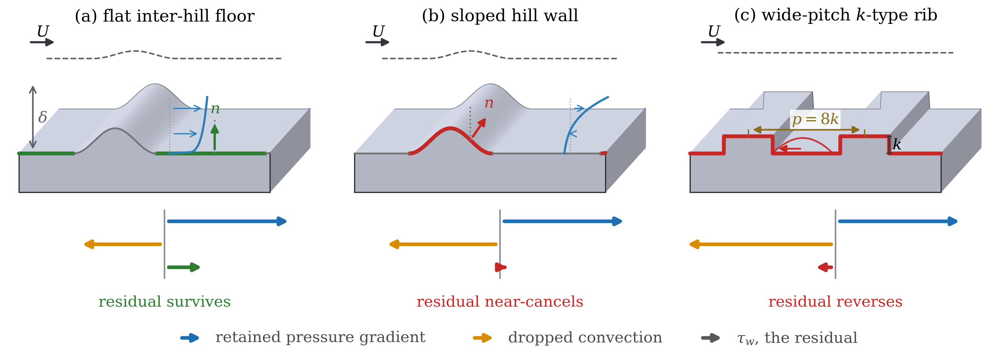
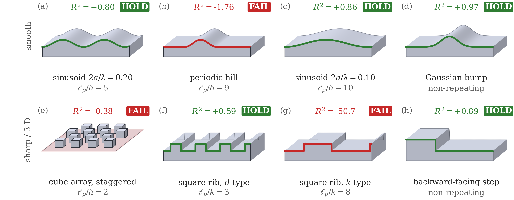

# Wall-modelled large-eddy simulation over repeating structures: conditioning, not missing physics, limits reduced wall models

Code and data records for the article of the above title by **Jianou Jiang** and
**Budimir Rosic**, Department of Engineering Science, University of Oxford, Oxford OX1 3PJ, UK
(corresponding author: `jianou.jiang@eng.ox.ac.uk`).

> **Status: submitted to *Computer Methods in Applied Mechanics and Engineering* (Elsevier),
> September 2026, and under review.** Citation details will be added here on publication.
> The numbers, figures and records in this repository are those of the submitted manuscript.
> The full reproducibility deposit (solver cases, reduced data, uncertainty ensembles) is
> archived on Zenodo: **[doi:10.5281/zenodo.22069527](https://doi.org/10.5281/zenodo.22069527)**.



*Figure 1 of the article. What a reduced wall model must return is the residual of the term
the balance retains against the term it drops. (a) On the flat inter-hill floor the residual
survives and the reduction closes. (b) On the sloped wall of the same hill the two terms nearly
cancel. (c) On the wide-pitch rib the residual is opposite in sign to the drive, so no model
returning a positive drag can be right there.*

## What the study is about

Wall-modelled large-eddy simulation takes the wall shear stress from a one-dimensional
ordinary-differential-equation (ODE) wall model instead of resolving the near-wall layer. Such
models are deployed over surfaces that repeat, and are known to fail over periodic hills, a
failure usually attributed to the streamwise convection and transport the one-dimensional
balance omits. The omission is real; the question the article asks is whether restoring it
helps. Auditing every term of the wall-layer momentum balance, a priori and in coupled
calculations, over periodic hills, a wavy wall, square ribs and cube arrays, it finds that the
traction such a model must return is a small residual of two large opposing forces, so that
recovering it by differencing is ill-conditioned by a factor the geometry fixes in advance.
Supplying the omitted transport exactly is worse than the crudest equilibrium closure; a
smooth modelled source is accurate. A finite-volume wall condition is also proved to lock the
delivered traction to the sign of the matching velocity.



*Figure 2 of the article. Each badge is read from the balance on its wall, not from the shape
of the cell; the badges follow no geometric order, and that is the point.*

## The geometry ladder

The claim is about *repeating structures*, not one canonical case, so the evidence spans a
ladder from smooth to sharp, every rung at wall-resolved LES fidelity with matched numerics
(identical solver, schemes, subgrid model, time-step policy, averaging window and
post-processing; only the geometry changes):

| Rung | Geometry | Character |
|---|---|---|
| 1 | Smooth wavy wall, `2a/lambda = 0.10` | mildest repeating surface, validated against published DNS and experiment |
| 2 | Smooth wavy wall, `2a/lambda = 0.20` | twice the steepness, everything else identical |
| 3 | Periodic hills (29-member family, plus coupled runs at four Reynolds numbers) | the canonical separated case |
| 4 | Square ribs, d-type (`p/k = 3`) and k-type (`p/k = 8`) | sharp, two-dimensional, short and long pitch |
| 5 | Cube arrays: aligned, staggered and sparse | sharp, fully three-dimensional |

A backward-facing step and a converging-diverging channel serve as non-repeating controls.

## Repository layout

```
codes/analysis/                   analysis and reduction programs
codes/analysis/ledger_verifiers/  independent verification programs, one per load-bearing claim
codes/figures/                    figure generators; every value is read from a record in records/
records/                          reduced result records (JSON) behind every reported number
replay/                           how to re-run the checks, with or without the archived deposit
figures/                          the ten figures as they appear in the article
SHA256SUMS.txt                    checksums of the records
```

Every figure generator reads its values from a record in `records/`; none of them has a number
typed into it. Where a scoring reference was withdrawn during the study, both the superseded and
the corrected values are retained in the record rather than overwritten, so the provenance of
every printed number can be followed.

Large binary data (raw fields, decomposed simulation output, full uncertainty ensembles, the
OpenFOAM cases and the wall-model implementation) are not in this repository. They are in the
Zenodo deposit.

## Verification programs

Each load-bearing claim in the article is bound to a program under
`codes/analysis/ledger_verifiers/` that rebuilds it from the records and fails if the number,
the interval or the stated condition does not hold. They are written to be run by a reader, not
only by us, and several carry deliberately corrupted control cases so that a check which cannot
fail is visible as such. Each prints one line per check, `[PASS]` or `[FAIL]`, with the
quantity, the measured value and the condition, and exits non-zero on the first failure.

```bash
pip install -r requirements.txt
for v in codes/analysis/ledger_verifiers/verify_*.py; do python3 "$v"; done
```

Programs that need the bulk arrays report the missing input rather than passing silently;
`replay/README.md` explains how to stage them from the deposit.

## Regenerating a figure

```bash
python3 codes/figures/fig_class_map.py        # figure 2
python3 codes/figures/fig_regime_map.py       # figure 1
```

## Data availability

The reproducibility deposit, sufficient to reproduce every figure, table and in-text number,
is openly available on Zenodo under **doi:10.5281/zenodo.22069527** (CC BY 4.0 for the reduced
records, MIT for the code). Third-party DNS and experimental reference datasets are not
redistributed; they are cited to their original sources in the article.

## Citation

J. Jiang and B. Rosic, *Wall-modelled large-eddy simulation over repeating structures:
conditioning, not missing physics, limits reduced wall models*, submitted to Computer Methods
in Applied Mechanics and Engineering (2026). Reproducibility deposit: doi:10.5281/zenodo.22069527.

## Licence

MIT for the code (see `LICENSE`). Reduced data records are released under CC BY 4.0 through the
Zenodo deposit. Third-party datasets remain under their original terms.
